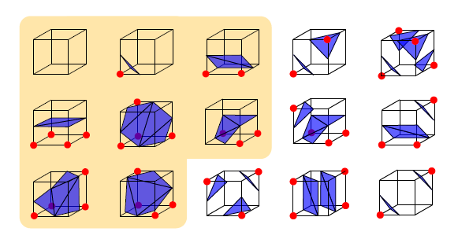

不失一般性，以抽取 0 等值面举例，假设面一侧为正值，另一侧为负值。则 Marching Cubes 算法总体上通过两个步骤建立这个等值面的 mesh 模型：

1. 估计每个 cell 内的三角面片数量与连接方式（拓扑结构）
2. 计算确定个面片的每个顶点的具体位置

>  这里的 cell 区别于 voxel。voxel 可认为是对三维场的采样与离散，采样点位于 voxel 中心，这些采样点作为顶点则构成了 cell。即 cell 是以采样点为顶点的三维网格。

具体而言，对每一个 cell，首先确定这个 cell 内部面片的拓扑结构。即通过判断这个 cell 各顶点的符号来判断 cell 哪部分处于面内。当相邻两顶点符号改变时，表名这条边穿过了面，因此该边上必定有一个面片顶点（vertice）。这样，每个顶点都有两种情况：面内、面外，总共就有2^8 = 256 中情况，这些情况可归类为 15 中基本情况：

图中黄色背景的代表 cell 内只有一个连续面片的情况；其它则代表有多个面片的情况。

得到拓扑结构后，对每条包含 vertice 的边进行线性插值，找到 0 值的位置，即可作为 vertice 的坐标，由此完成 mesh 提取。